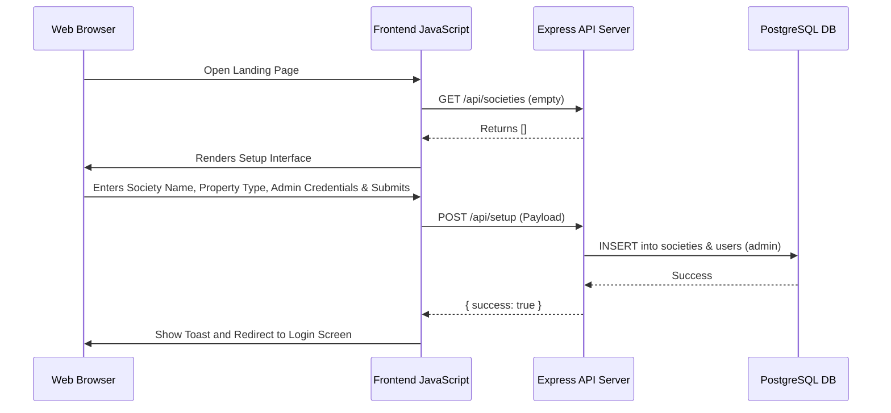
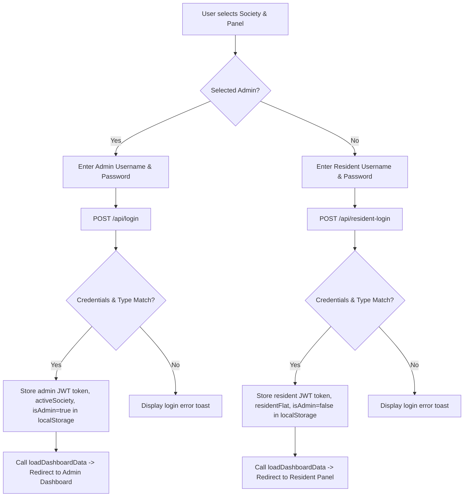
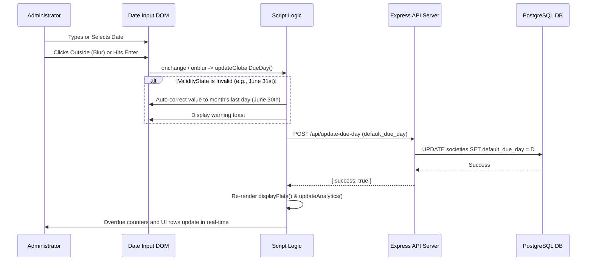

# Application Flow (APP_FLOW)
## Project Name: Society Maintenance Portal

---

## 1. Core Workflows & System Processes

This document details the step-by-step flow of key actions in the Society Maintenance Portal.

### 1.1 First-Time Setup Flow
When the application has no registered societies:

---

### 1.2 User Authentication Flow (Admin vs. Resident)
Routing users based on their target panel:

---

### 1.3 Monthly Ledger Billing & Payment Action Flow
How administrators process monthly maintenance records:

1. **Dashboard Initialization**:
   * Admin lands on the dashboard.
   * Client calls `Api.getSociety(name, type)` with custom `_t` timestamp parameter.
   * Server queries units and invoices, builds the `apartmentData` map, and returns it.
   * Client renders the flat rows and calls `updateAnalytics()`.
2. **Reviewing Payment Ledger**:
   * Admin filters flats by Block or Payment Status (Paid / Pending).
   * Dues calculations evaluate the global due date. Any pending flats where `today > dueDate` are flagged as **Overdue**.
3. **Updating Flat Status (`✅ Paid`)**:
   * Admin clicks `✅ Paid` button on a flat row.
   * Javascript intercepts the event, collects unit details, plan type (monthly/yearly), payment method, and executes `Api.saveFlat()`.
   * Backend writes the invoice record (`status='Paid'`, `paid_at=NOW()`) and adds a transaction entry in `payment_transactions`.
   * Backend returns `{ success: true }`.
   * Frontend receives response, triggers `loadDashboardData()`.
   * Frontend performs cache-busted GET request to pull the updated society JSON.
   * Frontend updates DOM tables, adjusts `#overdueCount`, `#pendingCount`, and `#paidCount` instantly without reloading the page.

---

### 1.4 Setting Global Parameters (Due Day & Maintenance)
The validation and propagation workflow for administrative settings:

---

### 1.5 Admin/Resident Password Reset Workflow
Identity verification using secure OTP triggers:

1. **Initiation**: User clicks "Forgot Password" on the login screen.
2. **Identity Verification**:
   * User inputs their username and mobile number.
   * Client fires `POST /api/request-resident-otp`.
   * Server checks if username and mobile number exist and match. If true, server generates a 6-digit OTP code, starts a 5-minute expiry timer, and dispatches it via Twilio SMS.
3. **OTP Validation**:
   * User receives the text and inputs the code into the client modal.
   * Client sends `POST /api/verify-resident-otp` with username and OTP.
   * Server validates the OTP code. If correct, it returns `{ success: true }` and opens the Reset Password screen.
4. **Reset**:
   * User types their new password.
   * Client checks complexity, hashes it using bcrypt, and updates the database record.
