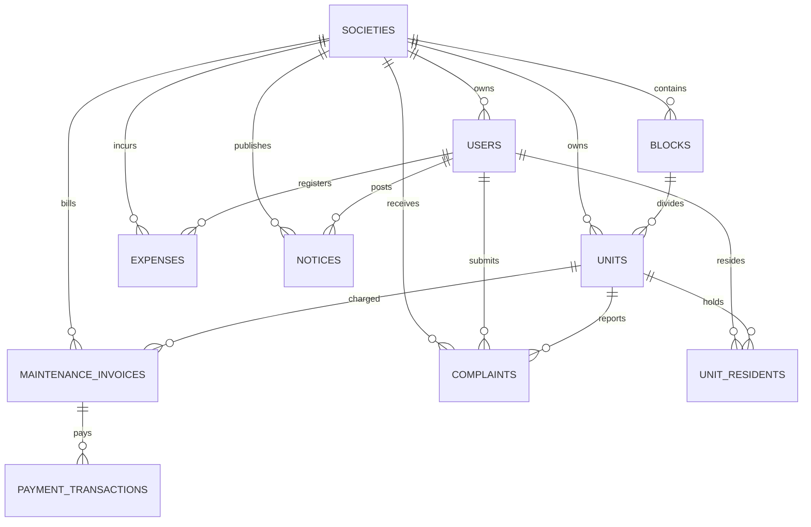

# Backend Schema (BACKEND_SCHEMA)
## Project Name: Society Maintenance Portal

---

## 1. Database Architecture & Relationships

The **Society Maintenance Portal** backend is powered by a relational PostgreSQL database schema. The design enforces strict referential integrity, indexes key columns for efficient dashboard querying, and implements automatic updates on modification times using procedural trigger functions.

---

## 2. Table Schema Definitions

### 2.1 societies
Stores configuration and basic parameters for each residential society.

| Column | Type | Constraints | Description |
| :--- | :--- | :--- | :--- |
| `id` | BIGSERIAL | PRIMARY KEY | Unique auto-incrementing ID. |
| `society_name` | VARCHAR(255) | UNIQUE, NOT NULL | Name of the society (used for routing/login). |
| `property_type` | VARCHAR(20) | CHECK (flat, villa, shop, mixed) | Category of real estate structure. |
| `total_blocks` | INT | DEFAULT 0 | Count of blocks configured. |
| `total_units` | INT | DEFAULT 0 | Count of flats/bungalows configured. |
| `address` | TEXT | | Society billing address, metadata JSON. |
| `city` / `state` | VARCHAR(100) | | City and state locations. |
| `pincode` | VARCHAR(20) | | PIN/ZIP code. |
| `default_due_day` | SMALLINT | DEFAULT 1 | Default calendar day when maintenance is due. |
| `monthly_maintenance`| DECIMAL(12,2) | DEFAULT 0.00 | Standard charge per period. |
| `created_at` / `updated_at`| TIMESTAMP | DEFAULT CURRENT_TIMESTAMP | Timestamps. |

---

### 2.2 users
Stores authentication credentials and roles for admins, committee members, residents, and staff.

| Column | Type | Constraints | Description |
| :--- | :--- | :--- | :--- |
| `id` | BIGSERIAL | PRIMARY KEY | Unique user ID. |
| `society_id` | BIGINT | REFERENCES societies(id) | Linked society. |
| `username` | VARCHAR(100) | UNIQUE, NOT NULL | Unique login name. |
| `phone` | VARCHAR(15) | | Phone number (used for Twilio OTP reset). |
| `password_hash` | VARCHAR(255) | NOT NULL | Salted bcrypt hash of password. |
| `full_name` | VARCHAR(255) | NOT NULL | Primary name. |
| `role` | VARCHAR(20) | CHECK (super_admin, admin, committee, resident, staff) | Security role. |

---

### 2.3 blocks
Logical divisions of a society (e.g. Block A, Block B).

| Column | Type | Constraints | Description |
| :--- | :--- | :--- | :--- |
| `id` | BIGSERIAL | PRIMARY KEY | Unique block ID. |
| `society_id` | BIGINT | REFERENCES societies(id) | Linked society. |
| `block_name` | VARCHAR(20) | UNIQUE (society_id, block_name) | Block identifier (A, B, C etc). |

---

### 2.4 units (Flats / Bungalows)
Physical units within blocks.

| Column | Type | Constraints | Description |
| :--- | :--- | :--- | :--- |
| `id` | BIGSERIAL | PRIMARY KEY | Unique unit ID. |
| `society_id` | BIGINT | REFERENCES societies(id) | Linked society. |
| `block_id` | BIGINT | REFERENCES blocks(id) | Linked block. |
| `unit_number` | VARCHAR(20) | UNIQUE (society_id, unit_number) | Flat identifier (e.g., "101", "A-12"). |
| `occupancy_status` | VARCHAR(20) | CHECK (occupied, vacant, maintenance) | Status. |

---

### 2.5 unit_residents
Associates users with units as owners or tenants, tracking history.

| Column | Type | Constraints | Description |
| :--- | :--- | :--- | :--- |
| `id` | BIGSERIAL | PRIMARY KEY | Unique ID. |
| `unit_id` | BIGINT | REFERENCES units(id) | Target flat. |
| `user_id` | BIGINT | REFERENCES users(id) | Target user. |
| `resident_type` | VARCHAR(20) | CHECK (owner, tenant, family_member) | Residency role. |
| `is_primary` | SMALLINT | DEFAULT 0 | Active flag (1 = primary owner/tenant). |
| `move_in_date` | DATE | | Check-in date. |
| `move_out_date` | DATE | NULL | Check-out date (null if currently active). |
| `is_active` | SMALLINT | DEFAULT 1 | Active state flag. |

---

### 2.6 maintenance_invoices
Core ledger storing monthly maintenance dues and invoices.

| Column | Type | Constraints | Description |
| :--- | :--- | :--- | :--- |
| `id` | BIGSERIAL | PRIMARY KEY | Invoice unique ID. |
| `society_id` | BIGINT | REFERENCES societies(id) | Linked society. |
| `unit_id` | BIGINT | REFERENCES units(id) | Target unit. |
| `invoice_number` | VARCHAR(50) | UNIQUE | Formatted invoice ID (e.g., `INV-123-2026-6`). |
| `billing_year` | INT | NOT NULL | Year. |
| `billing_month` | SMALLINT | NOT NULL | Month (1-12). |
| `amount` | DECIMAL(12,2) | NOT NULL | Bill amount. |
| `due_date` | DATE | NOT NULL | Target payment deadline. |
| `status` | VARCHAR(20) | CHECK (Pending, Paid, Partial, Overdue, Cancelled) | Ledger state. |
| `paid_at` | TIMESTAMP | NULL | Date payment was captured. |

---

### 2.7 payment_transactions
Financial transaction records mapping to paid invoices.

| Column | Type | Constraints | Description |
| :--- | :--- | :--- | :--- |
| `id` | BIGSERIAL | PRIMARY KEY | Transaction unique ID. |
| `invoice_id` | BIGINT | REFERENCES maintenance_invoices(id) | Target invoice. |
| `payment_method` | VARCHAR(20) | CHECK (cash, upi, bank_transfer, card, cheque) | Method. |
| `amount` | DECIMAL(12,2) | NOT NULL | Sum paid. |
| `status` | VARCHAR(20) | CHECK (Pending, Success, Failed, Refunded) | Gateway status. |
| `paid_at` | TIMESTAMP | NULL | Capture timestamp. |

---

### 2.8 expenses
Society expenditure logbook.

| Column | Type | Constraints | Description |
| :--- | :--- | :--- | :--- |
| `id` | BIGSERIAL | PRIMARY KEY | Expense unique ID. |
| `society_id` | BIGINT | REFERENCES societies(id) | Linked society. |
| `title` | VARCHAR(255) | NOT NULL | Expense title. |
| `amount` | DECIMAL(12,2) | NOT NULL | Sum spent. |
| `expense_date` | DATE | NOT NULL | Date occurred. |
| `notes` | TEXT | | Notes and description. |

---

### 2.9 notices & rules
Stores broadcasts and static guidelines. Rules are notices prefixed with `_rule_` in the database.

| Column | Type | Constraints | Description |
| :--- | :--- | :--- | :--- |
| `id` | BIGSERIAL | PRIMARY KEY | Notice unique ID. |
| `society_id` | BIGINT | REFERENCES societies(id) | Linked society. |
| `title` | VARCHAR(255) | NOT NULL | Notice title (rules start with `_rule_`). |
| `details` | TEXT | NOT NULL | Text details. |
| `publish_date` | TIMESTAMP | DEFAULT CURRENT_TIMESTAMP | Post date. |

---

### 2.10 complaints
Helpdesk tickets generated by residents.

| Column | Type | Constraints | Description |
| :--- | :--- | :--- | :--- |
| `id` | BIGSERIAL | PRIMARY KEY | Ticket unique ID. |
| `society_id` | BIGINT | REFERENCES societies(id) | Linked society. |
| `unit_id` | BIGINT | REFERENCES units(id) | Linked unit. |
| `created_by` | BIGINT | REFERENCES users(id) | Submitting resident. |
| `title` | VARCHAR(255) | NOT NULL | Ticket title. |
| `details` | TEXT | NOT NULL | Ticket description. |
| `status` | VARCHAR(20) | CHECK (Open, In Progress, Resolved, Closed) | Ticket status. |

---

## 3. Database Indexes

To optimize dashboard operations, several indexes are set on the foreign keys and status flags:

* `idx_society_city` on `societies (city)`
* `idx_user_society` on `users (society_id)`
* `idx_user_role` on `users (role)`
* `idx_unit_block` on `units (block_id)`
* `idx_unit_status` on `units (occupancy_status)`
* `idx_invoice_status` on `maintenance_invoices (status)`
* `idx_invoice_due_date` on `maintenance_invoices (due_date)`
* `idx_payment_invoice` on `payment_transactions (invoice_id)`
* `idx_expense_date` on `expenses (expense_date)`
* `idx_complaint_status` on `complaints (status)`
