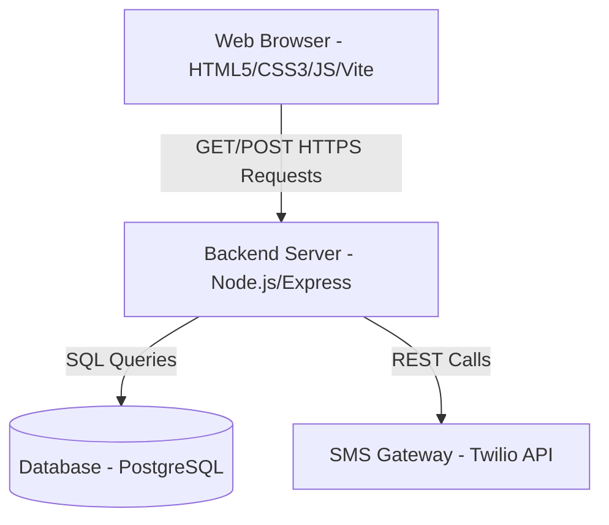

# Technical Requirements Document (TRD)
## Project Name: Society Maintenance Portal

---

## 1. System Architecture

The application is built on a standard three-tier architecture:



---

## 2. Technology Stack

### 2.1 Frontend
* **Core**: Vanilla HTML5, Vanilla JavaScript (ES6+ Modules), and CSS3.
* **Styling**: Vanilla CSS with custom property tokens for themes. Tailwind CSS is used for responsive layout utilities.
* **Build Tool**: Vite (used for bundling frontend resources, minification, and hot module replacement).
* **Dependencies**:
  * Native ES6 Modules for modular structures (`api.js`, `script.js`).

### 2.2 Backend
* **Runtime**: Node.js
* **Framework**: Express (REST API and static file serving)
* **Database Driver**: `pg` (PostgreSQL client) with query compatibility mapping to SQL standards.
* **Security & Utility Packages**:
  * `bcryptjs`: Secure password hashing (10 rounds).
  * `jsonwebtoken`: Stateless authentication tokens (JWT).
  * `cors`: Cross-Origin Resource Sharing handler.
  * `helmet`: HTTP headers security.
  * `express-rate-limit`: Rate limiting middleware to prevent brute force.
  * `swagger-ui-express` & `yamljs`: REST API Swagger documentation interface.
  * `twilio`: Interface to Twilio SMS gateway for OTP dispatch.

### 2.3 Database
* **Database Management System**: PostgreSQL (v14+)
* **Hosting**: Local/Cloud instances, connected via pooling configuration (`DB_CONNECTION_LIMIT=10`).

---

## 3. Detailed Component Technical Specifications

### 3.1 Security & Authentication
* **x-api-key**: All administrative and critical requests require an API key validation header (`x-api-key: hms-api-key-2024-secure`) to prevent unauthorized API probing.
* **JWT Tokens**:
  * Issued upon successful admin or resident login.
  * Payload: `{ id, username, role, society_id }`.
  * Expiry: `24h`.
  * Checked by `verifyToken` middleware in the backend, mounted at `/api` level.
* **Password Rules**: Regular expression validation in both client and server: `/^(?=.*[a-zA-Z])(?=.*\d)(?=.*[^a-zA-Z0-9]).{5,}$/` (requires letters, digits, and a special character; minimum 5 characters).

### 3.2 Caching Prevention Strategy
To ensure dashboard metrics and status tables reload instantly on POST/DELETE events without displaying stale browser-cached responses:
* **HTTP Header Control**: The Express backend enforces cache suppression for all REST requests:
  ```javascript
  res.setHeader("Cache-Control", "no-store, no-cache, must-revalidate, proxy-revalidate");
  res.setHeader("Pragma", "no-cache");
  res.setHeader("Expires", "0");
  ```
* **URL Cache-Busting**: The frontend fetch client intercepts all GET requests and:
  1. Sets headers: `Cache-Control: no-cache`.
  2. Appends a unique cache-buster parameter `_t=Date.now()` to the request URL string.

### 3.3 Dynamic Date Capping & Input Validation
* **Min/Max Scope Binding**: To prevent users from entering invalid days (e.g. June 31st) inside the `#globalDueDate` input, the script evaluates the current period month and updates the DOM attributes `min` and `max` dynamically:
  ```javascript
  input.min = `${year}-${String(mIdx + 1).padStart(2, '0')}-01`;
  input.max = `${year}-${String(mIdx + 1).padStart(2, '0')}-${String(lastDateOfMonth).padStart(2, '0')}`;
  ```
* **HTML5 ValidityState Handler**: If a user bypasses range limits by manually typing an invalid day, the change handler catches the `validity.valid === false` condition, resets the value to the month's maximum day (e.g. `30` for June), and outputs a warning toast.

### 3.4 Twilio OTP Implementation
* **Step 1**: The user requests an OTP. The server generates a random 6-digit number, stores it in a volatile database/cache, and sends it to the user's phone via Twilio Programmable SMS.
* **Step 2**: The user inputs the code. The server validates the code, and if valid, unlocks password reset privileges.

### 3.5 API Specification
The key API endpoints are summarized below:

| Endpoint | Method | Auth Required | Description |
| :--- | :---: | :---: | :--- |
| `/api/setup` | POST | API Key | First-time setup configuration. |
| `/api/login` | POST | API Key | Admin login to retrieve JWT. |
| `/api/resident-login`| POST | API Key | Resident login to retrieve JWT. |
| `/api/societies` | GET | API Key | Fetch list of active societies. |
| `/api/society/:name/:type` | GET | JWT | Fetch full society config and ledgers. |
| `/api/flat` | POST | JWT | Save or update flat status, owner details. |
| `/api/expense` | POST | JWT | Add or edit an expenditure. |
| `/api/notice` | POST | JWT | Add or edit a notice. |
| `/api/rule` | POST | JWT | Add or edit a rule. |
| `/api/complaint` | POST | JWT | Submit or resolve a complaint. |
| `/api/update-due-day`| POST | JWT | Update the society global due day. |
| `/api/request-resident-otp` | POST | API Key | Generate and send Twilio SMS OTP. |
